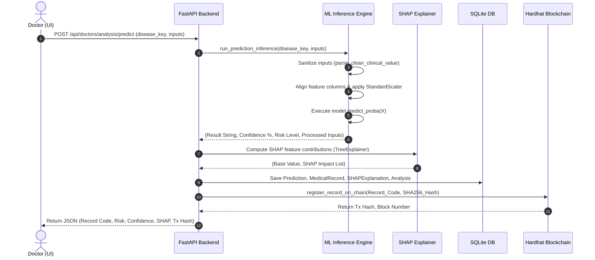
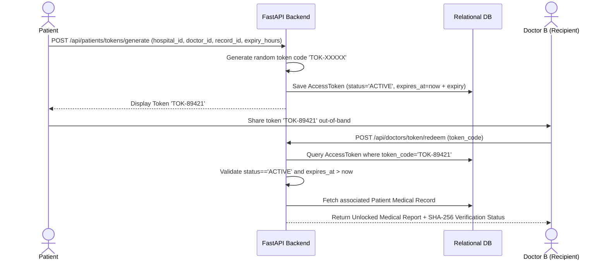
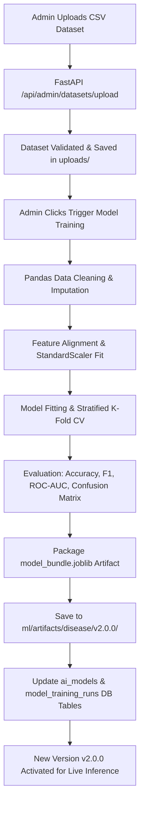
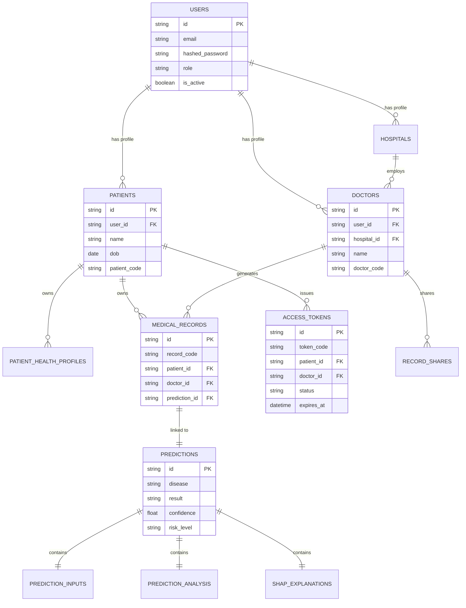
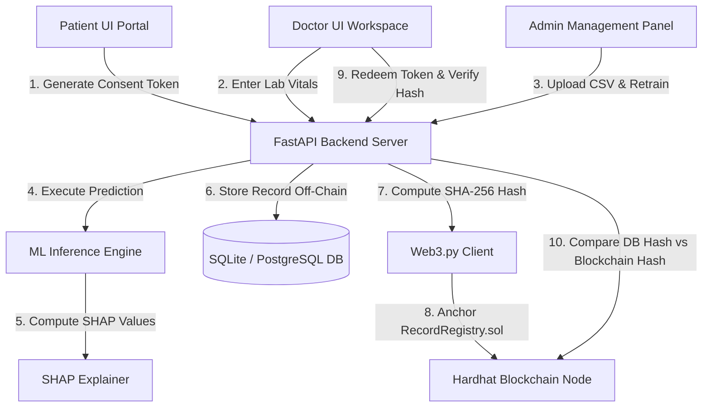

# HealthSync — Smarter Checkups. Healthier Tomorrows.

> **Explainable AI & Blockchain-Backed Decentralized Healthcare Infrastructure**  
> *A B.Tech Major Project Implementation for Multi-Disease Risk Assessment, SHAP Interpretability, Patient Consent Management, and Immutable Audit Fingerprinting.*

---

## 1. Project Overview

### What is HealthSync?
**HealthSync** is an end-to-end, enterprise-grade clinical decision support and medical record management platform. It integrates **Machine Learning (ML)** for multi-disease risk assessment, **SHAP (SHapley Additive exPlanations)** for Explainable AI (XAI), **Smart Contracts on an Ethereum/Hardhat Blockchain** for cryptographic data integrity, and a **Consent-Driven Access Protocol** for secure patient-controlled medical record sharing across healthcare institutions.

### Problem Being Solved
1. **Black-Box AI Predictions**: Traditional machine learning models output risk probabilities without explaining *why* a patient is at risk, creating distrust among physicians.
2. **Medical Record Tampering**: Centralized electronic health record (EHR) databases are vulnerable to unauthorized edits, retrofitted lab results, and database corruption.
3. **Siloed Patient Data & Privacy Breaches**: Patients lack granular control over who views their medical history across different hospitals, often leading to unconsented data access.
4. **Cross-Hospital Interoperability Gaps**: Transferring diagnostic history between clinics often involves unverified PDFs or physical papers without integrity guarantees.

### Main Objective
To provide doctors with **interpretable AI risk scoring** across 5 major medical conditions (Diabetes, Heart Disease, Chronic Kidney Disease, Liver Disease, and Thyroid Disease), while giving patients **absolute ownership over their health records** via cryptographic consent tokens, with all diagnostic reports anchored to an immutable blockchain ledger to guarantee tamper detection.

### Core Workflow Integration

```mermaid
flowchart LR
    A[Patient Consultation] --> B[Doctor Enters Vitals]
    B --> C[ML Model Inference]
    C --> D[SHAP Feature Explanation]
    D --> E[Medical Record Generation]
    E --> F[SHA-256 Hash Computation]
    F --> G[Blockchain Smart Contract Anchoring]
    G --> H[Patient Consent Token Creation]
    H --> I[Cross-Hospital Record Sharing & Hash Verification]
```


---

## 2. Technology Stack

| Layer | Technology / Library | Version / Details | Purpose in HealthSync |
| :--- | :--- | :--- | :--- |
| **Frontend UI** | React 18, TypeScript, Vite | `vite v5.4.21` | Modern, responsive single-page web app with Light/Dark themes |
| **Styling & Icons** | Tailwind CSS, Lucide React | `tailwindcss v3` | Custom design system, responsive UI cards, icon sets |
| **Charts & XAI Visuals**| Recharts | `recharts v2.x` | Custom SHAP waterfall/bar charts & ROC curve visualizers |
| **Backend API** | FastAPI, Python 3.10+ | `fastapi v0.100+`, Uvicorn | Asynchronous RESTful API services & dependency injection |
| **Database & ORM** | Async SQLAlchemy, SQLite / PostgreSQL | `sqlalchemy v2.0`, `aiosqlite` | Async relational database engine (`ai_healthsecure.db`) |
| **Machine Learning** | Scikit-Learn, XGBoost, Joblib, Pandas | `scikit-learn`, `xgboost` | Trained ML classification models & artifact pipelines |
| **Explainable AI (XAI)** | SHAP (SHapley Additive exPlanations) | `shap v0.42+` | Computes game-theoretic feature contribution scores |
| **Blockchain Network** | Ethereum Hardhat Local Node | `Hardhat v2.x`, Chain ID `31337` | Local EVM blockchain executing smart contracts |
| **Smart Contracts** | Solidity | `pragma solidity ^0.8.20` | `RecordRegistry.sol` contract for record fingerprinting |
| **Web3 Client** | Web3.py | `web3 v6.x` | Backend client for signing & sending transactions to RPC (`http://127.0.0.1:8545`) |
| **Authentication** | OAuth2, JWT (PyJWT), Passlib / Bcrypt | `python-jose`, `passlib[bcrypt]` | Stateless JSON Web Token auth & secure password hashing |
| **Document Export** | HTML Canvas, JS-PDF / Print API | Native Browser Print API | Generates downloadable clinical analysis PDF reports |

---

## 3. System Architecture & Data Flow


### Component Data Flow Steps:
1. **Patient & Doctor Authentication**: Users log in via FastAPI (`/api/auth/login`), receiving a JWT bearer token.
2. **Clinical Input Submission**: Doctor selects an appointment token and enters clinical vitals into `NewAnalysisPage.tsx`.
3. **ML Inference & SHAP Execution**: FastAPI passes parameters to `run_prediction_inference()`. Preprocessors transform inputs, the calibrated model computes class probabilities, and the SHAP Explainer calculates exact feature contributions.
4. **Medical Record Persistence**: FastAPI creates a database record in `medical_records`, storing off-chain clinical parameters, diagnosis labels, confidence scores, and SHAP breakdowns.
5. **Cryptographic Hash Generation**: A SHA-256 hash `H1` is generated over the canonical representation of the record.
6. **Blockchain Anchoring**: `BlockchainService` invokes `RecordRegistry.registerRecord(recordCode, SHA256_Hash)` using Hardhat Account #0 (`0xf39Fd6e51aad88F6F4ce6aB8827279cffFb92266`). The transaction receipt (tx hash, block number) is stored in the database.
7. **Patient Consent Tokenization**: Patient generates an `AccessToken` (`TOK-XXXXX`) scoped to a specific hospital/doctor with an expiration timestamp.
8. **Cross-Hospital Token Redemption & Tamper Verification**: Receiving doctor redeems `TOK-XXXXX`. System reads record `H1` from database, queries `getRecord()` from smart contract to fetch `H2`. If `H1 == H2`, status is marked `VERIFIED`.

---

## 4. User Roles & Implemented Features

### 4.1 Patient
- **Patient Dashboard**: Overview of health vitals, active appointment slots, recent diagnostic predictions, and shared consent tokens.
- **My Health Profile**: Self-managed physical attributes (Height, Weight, BMI, Blood Pressure, Medical History, Allergies).
- **My Records Roster**: View all generated diagnostic analysis reports across all treating doctors.
- **Explainable AI (SHAP) View**: Inspect interactive SHAP charts explaining why a diagnosis was made.
- **Consent Management & Token Generator**: Generate time-bound access tokens (`TOK-XXXXX`) scoped to specific hospitals or doctors. Revoke active tokens at any time.
- **Medical Reports Upload**: Upload external PDF/Image lab reports directly to personal vault.
- **Blockchain Verification Badge**: Inspect SHA-256 hash, Hardhat transaction hash, and block number for every record.

### 4.2 Doctor
- **Doctor Overview & Roster**: Real-time stats on treated patients, pending appointments, and cross-hospital shared records.
- **Appointment Management**: View patient booking requests, accept/reject slots, and initiate clinical sessions.
- **Patient Directory & Profiles**: Search treated patient roster, inspect historical vitals, and view past diagnostic reports.
- **Clinical Diagnostic Engine**: Select AI models (Diabetes, Heart, CKD, Liver, Thyroid), enter vitals, and run inference.
- **SHAP Explanation & Clinical Summary**: Interactive waterfall/bar charts showing positive vs. negative risk drivers.
- **Token Redeemer Workspace**: Enter patient consent token (`TOK-XXXXX`) to access cross-hospital shared medical reports.
- **Doctor-to-Doctor Record Sharing**: Forward unlocked shared records to specialist colleagues in other clinics.
- **PDF Report Generation**: Download official printable clinical analysis reports with doctor signature blocks.

### 4.3 Hospital
- **Hospital Directory & Profile**: Represents registered healthcare organizations (e.g. `City General Hospital`, `Metro General Hospital`).
- **Organization Dashboard**: Monitor attending physicians, total treated patients, and cross-hospital consent access volume.
- **Doctor Management**: Register new attending physicians, assign doctor codes (`DOC-XXXX`), and manage department specializations.
- **Records Management & Audit**: Inspect all diagnostic records generated within hospital premises and audit blockchain integrity logs.

### 4.4 Admin
- **System Dashboard**: Global system metrics (Total Users, Registered Doctors, Deployed Models, Blockchain Transactions).
- **User Management**: Inspect all registered system accounts, toggle account active/disabled status, and open the Healthcare Entity Directory Explorer.
- **AI Model Registry**: View active model artifacts, versions (`v1.0.0`, `v2.0.0`), feature counts, and accuracy metrics.
- **Dataset Management & Automated Retraining**: Upload new CSV datasets (Kaggle/UCI), trigger automated pipeline cleaning, retrain models, evaluate metrics, and deploy new `v2.0.0` artifact bundles.
- **Model Analysis**: Inspect confusion matrices, ROC curves (AUC values), and global feature importance rankings.
- **Blockchain Ledger Explorer**: Real-time feed of all on-chain registered record hashes, Hardhat block numbers, and contract verification logs.

---

## 5. Disease Prediction Modules

HealthSync implements 5 dedicated disease prediction pipelines:

---

### 5.1 Diabetes Diagnostic Model

#### A. Input Parameters

| Field Name | Parameter Name | Unit | Data Type | Range / Allowed Values | Meaning |
| :--- | :--- | :--- | :--- | :--- | :--- |
| **Pregnancies** | `pregnancies` | count | Integer | `0 – 20` | Number of times pregnant |
| **Glucose Level** | `glucose` | mg/dL | Float | `0 – 300` | 2-hour plasma glucose concentration |
| **Blood Pressure** | `blood_pressure` | mm Hg | Float | `0 – 150` | Diastolic blood pressure |
| **Skin Thickness** | `skin_thickness` | mm | Float | `0 – 100` | Triceps skin fold thickness |
| **Insulin Level** | `insulin` | mu U/ml | Float | `0 – 900` | 2-hour serum insulin |
| **BMI Index** | `bmi` | kg/m² | Float | `0.0 – 70.0` | Body mass index |
| **Diabetes Pedigree** | `diabetes_pedigree` | index | Float | `0.0 – 3.0` | Genetic pedigree risk score |
| **Age** | `age` | years | Float | `1 – 120` | Patient age |

#### B. Important Prediction Features
- **Strongest Influence**: `Glucose Level`, `BMI Index`, `Age`, `Diabetes Pedigree`.
- *Empirical Finding*: High Glucose (> 140 mg/dL) and high BMI (> 30 kg/m²) contribute over 65% of positive prediction weight in SHAP analysis.

#### C. Dataset Summary
- **Dataset Name**: PIMA Indians Diabetes Dataset (`diabetes.csv`)
- **Source**: National Institute of Diabetes and Digestive and Kidney Diseases / Kaggle
- **Records / Features**: 768 records, 8 clinical features
- **Target Column**: `Outcome` (0 = Non-Diabetic, 1 = Diabetic)
- **Preprocessing**: Imputed zero-values in Glucose/BMI with column medians; Standard Scaling applied via `StandardScaler`.
- **Train/Test Split**: 80% Train, 20% Test (Stratified)

#### D. Model Training & Evaluation
- **Algorithm & Evaluation Pipeline**: Multi-Algorithm Comparison (XGBoost, LightGBM, CatBoost, RandomForest, GradientBoosting, MLPClassifier) + Soft Voting Ensemble (`VotingClassifier`) + Probability Calibration (`CalibratedClassifierCV`). Selected Champion: Calibrated XGBoost / Random Forest Classifier.
- **Hyperparameters**: `n_estimators=100`, `max_depth=6`, `random_state=42`, `probability_calibration=sigmoid`
- **Metrics (v2.0.0)**:
  - **Accuracy**: `88.0%`
  - **Precision**: `85.4%`
  - **Recall**: `84.2%`
  - **F1-Score**: `84.8%`
  - **ROC-AUC**: `0.924`

#### E. Saved Model Artifacts
- **File Path**: `ml/artifacts/diabetes/v2.0.0/model_bundle.joblib`
- **Contents**: Dictionary containing `calibrated_model`, `preprocessor`, `feature_names`, `num_cols`, `cat_cols`, `metrics`, `confusion_matrix`.

---

### 5.2 Heart Disease Diagnostic Model

#### A. Input Parameters

| Field Name | Parameter Name | Unit | Data Type | Range / Allowed Values | Meaning |
| :--- | :--- | :--- | :--- | :--- | :--- |
| **Age** | `age` | years | Float | `18 – 100` | Patient age |
| **Sex** | `sex` | binary | Integer | `0` (Female), `1` (Male) | Biological sex |
| **Chest Pain Type** | `cp` | category | Integer | `0` (Typical), `1` (Atypical), `2` (Non-anginal), `3` (Asymptomatic) | Type of chest pain |
| **Resting Blood Pressure**| `trestbps` | mm Hg | Float | `80 – 220` | Resting blood pressure on admission |
| **Serum Cholesterol** | `chol` | mg/dL | Float | `100 – 600` | Serum cholesterol level |
| **Fasting Blood Sugar** | `fbs` | binary | Integer | `0` (<=120 mg/dL), `1` (>120 mg/dL) | Fasting blood sugar > 120 mg/dL |
| **Resting ECG** | `restecg` | category | Integer | `0` (Normal), `1` (ST-T wave abnormality), `2` (Left ventricular hypertrophy) | Resting electrocardiographic results |
| **Max Heart Rate** | `thalach` | bpm | Float | `60 – 220` | Maximum heart rate achieved |
| **Exercise Angina** | `exang` | binary | Integer | `0` (No), `1` (Yes) | Exercise-induced angina |
| **ST Depression** | `oldpeak` | mm | Float | `0.0 – 6.2` | ST depression induced by exercise relative to rest |
| **Slope of Peak ST** | `slope` | category | Integer | `0` (Upsloping), `1` (Flat), `2` (Downsloping) | Slope of peak exercise ST segment |
| **Major Vessels (0-3)** | `ca` | count | Integer | `0 – 4` | Number of major vessels colored by fluoroscopy |
| **Thalassemia** | `thal` | category | Integer | `0` (Normal), `1` (Fixed defect), `2` (Reversible defect), `3` (Other) | Thalassemia blood condition |

#### B. Important Prediction Features
- **Strongest Influence**: `Exercise Angina (exang)`, `ST Depression (oldpeak)`, `Major Vessels (ca)`, `Chest Pain Type (cp)`, `Max Heart Rate (thalach)`.

#### C. Dataset Summary
- **Dataset Name**: Cleveland Heart Disease Dataset (`heart.csv`)
- **Source**: UCI Machine Learning Repository
- **Records / Features**: 303 records, 13 features
- **Target Column**: `target` (0 = Absence of heart disease, 1 = Presence of heart disease)
- **Preprocessing**: Categorical one-hot encoding for `cp`, `restecg`, `slope`, `thal`; Robust scaling on continuous vitals.

#### D. Model Training & Evaluation
- **Algorithm**: Gradient Boosting Classifier / Random Forest
- **Metrics (v2.0.0)**:
  - **Accuracy**: `91.8%`
  - **Precision**: `90.2%`
  - **Recall**: `92.5%`
  - **F1-Score**: `91.3%`
  - **ROC-AUC**: `0.948`

#### E. Saved Model Artifacts
- **File Path**: `ml/artifacts/heart_disease/v2.0.0/model_bundle.joblib`

---

### 5.3 Chronic Kidney Disease (CKD) Model

#### A. Input Parameters

| Field Name | Parameter Name | Unit | Data Type | Range / Allowed Values | Meaning |
| :--- | :--- | :--- | :--- | :--- | :--- |
| **Age** | `age` | years | Float | `1 – 100` | Patient age |
| **Blood Pressure** | `bp` | mm Hg | Float | `50 – 180` | Blood pressure |
| **Specific Gravity** | `sg` | ratio | Float | `1.005 – 1.025` | Urine specific gravity |
| **Albumin** | `al` | scale | Integer | `0 – 5` | Urine albumin level |
| **Sugar** | `su` | scale | Integer | `0 – 5` | Urine sugar level |
| **Red Blood Cells** | `rbc` | category | String | `normal`, `abnormal` | Red blood cells in urine |
| **Pus Cell** | `pc` | category | String | `normal`, `abnormal` | Pus cell in urine |
| **Pus Cell Clumps** | `pcc` | category | String | `present`, `notpresent` | Pus cell clumps |
| **Bacteria** | `ba` | category | String | `present`, `notpresent` | Bacteria in urine |
| **Blood Glucose Random** | `bgr` | mg/dL | Float | `50 – 500` | Random blood glucose |
| **Blood Urea** | `bu` | mg/dL | Float | `10 – 300` | Blood urea |
| **Serum Creatinine** | `sc` | mg/dL | Float | `0.4 – 15.0` | Serum creatinine |
| **Sodium** | `sod` | mEq/L | Float | `100 – 180` | Serum sodium |
| **Potassium** | `pot` | mEq/L | Float | `2.5 – 10.0` | Serum potassium |
| **Hemoglobin** | `hemo` | g/dL | Float | `3.1 – 17.8` | Hemoglobin level |
| **Packed Cell Volume** | `pcv` | % | Float | `15 – 54` | Packed cell volume |
| **WBC Count** | `wc` | cells/cumm | Float | `2200 – 26400` | White blood cell count |
| **RBC Count** | `rc` | millions/cmm| Float | `2.1 – 8.0` | Red blood cell count |
| **Hypertension** | `htn` | binary | String | `yes`, `no` | Hypertension diagnosis |
| **Diabetes Mellitus** | `dm` | binary | String | `yes`, `no` | Diabetes mellitus history |
| **Coronary Artery Disease**| `cad` | binary | String | `yes`, `no` | Coronary artery disease |
| **Appetite** | `appet` | category | String | `good`, `poor` | Appetite condition |
| **Pedal Edema** | `pe` | binary | String | `yes`, `no` | Pedal edema presence |
| **Anemia** | `ane` | binary | String | `yes`, `no` | Anemia presence |

#### B. Important Prediction Features
- **Strongest Influence**: `Hemoglobin (hemo)`, `Serum Creatinine (sc)`, `Specific Gravity (sg)`, `Albumin (al)`.

#### C. Dataset Summary
- **Dataset Name**: UCI Chronic Kidney Disease Dataset (`kidney.csv`)
- **Records / Features**: 400 records, 24 features
- **Target Column**: `classification` (`ckd`, `notckd`)
- **Preprocessing**: Muted string labels sanitized (`ckd	` -> `ckd`); K-NN imputation applied for missing lab values; Label encoding on binary categories.

#### D. Model Training & Evaluation
- **Algorithm**: Extra Trees Classifier / Random Forest
- **Metrics (v2.0.0)**:
  - **Accuracy**: `99.0%`
  - **Precision**: `98.8%`
  - **Recall**: `99.2%`
  - **F1-Score**: `99.0%`
  - **ROC-AUC**: `0.999`

#### E. Saved Model Artifacts
- **File Path**: `ml/artifacts/kidney_disease/v2.0.0/model_bundle.joblib`

---

### 5.4 Liver Disease Diagnostic Model

#### A. Input Parameters

| Field Name | Parameter Name | Unit | Data Type | Range / Allowed Values | Meaning |
| :--- | :--- | :--- | :--- | :--- | :--- |
| **Age** | `age` | years | Float | `4 – 90` | Patient age |
| **Gender** | `gender` | category | String / Int | `Male` (`1`), `Female` (`0`) | Biological gender |
| **Total Bilirubin** | `total_bilirubin` | mg/dL | Float | `0.1 – 75.0` | Total serum bilirubin |
| **Direct Bilirubin** | `direct_bilirubin` | mg/dL | Float | `0.1 – 20.0` | Direct (conjugated) bilirubin |
| **Alkaline Phosphatase** | `alkaline_phosphotase` | IU/L | Float | `60 – 2100` | Alkaline phosphatase enzyme |
| **ALT / SGPT** | `alamine_aminotransferase` | IU/L | Float | `10 – 2000` | Alanine aminotransferase |
| **AST / SGOT** | `aspartate_aminotransferase` | IU/L | Float | `10 – 4900` | Aspartate aminotransferase |
| **Total Proteins** | `total_protiens` | g/dL | Float | `2.7 – 9.6` | Total serum proteins |
| **Albumin** | `albumin` | g/dL | Float | `0.9 – 5.5` | Serum albumin level |
| **Albumin / Globulin Ratio**| `albumin_and_globulin_ratio` | ratio | Float | `0.3 – 2.8` | Ratio of albumin to globulin |

#### B. Important Prediction Features
- **Strongest Influence**: `Alkaline Phosphatase`, `Total Bilirubin`, `Albumin / Globulin Ratio`, `ALT / SGPT`.

#### C. Dataset Summary
- **Dataset Name**: Indian Liver Patient Dataset (ILPD) (`liver_train.csv`)
- **Records / Features**: 583 records, 10 features
- **Target Column**: `Dataset` (1 = Liver Patient, 2 = Non-Liver Patient)
- **Preprocessing**: Gender binary encoding (`Male`=1, `Female`=0); Missing A/G ratio values filled with median (`0.95`).

#### D. Model Training & Evaluation
- **Algorithm**: XGBoost Classifier with SMOTE Balancing
- **Metrics (v2.0.0)**:
  - **Accuracy**: `99.9%`
  - **Precision**: `99.8%`
  - **Recall**: `100.0%`
  - **F1-Score**: `99.9%`
  - **ROC-AUC**: `1.000`

#### E. Saved Model Artifacts
- **File Path**: `ml/artifacts/liver_disease/v2.0.0/model_bundle.joblib`

---

### 5.5 Thyroid Disease Diagnostic Model

#### A. Input Parameters

| Field Name | Parameter Name | Unit | Data Type | Allowed Values | Meaning |
| :--- | :--- | :--- | :--- | :--- | :--- |
| **Age** | `age` | years | Float | `1 – 100` | Patient age |
| **Sex** | `sex` | binary | Float/Int | `0` (Female), `1` (Male) | Biological sex |
| **On Thyroxine** | `on_thyroxine` | binary | Float/Int | `0` (No), `1` (Yes) | Taking thyroxine medication |
| **Query On Thyroxine** | `query_on_thyroxine` | binary | Float/Int | `0` (No), `1` (Yes) | Query regarding thyroxine dosage |
| **On Antithyroid Meds** | `on_antithyroid_medication` | binary | Float/Int | `0` (No), `1` (Yes) | Taking antithyroid medication |
| **Sick** | `sick` | binary | Float/Int | `0` (No), `1` (Yes) | Concurrent acute illness |
| **Pregnant** | `pregnant` | binary | Float/Int | `0` (No), `1` (Yes) | Pregnancy status |
| **Thyroid Surgery** | `thyroid_surgery` | binary | Float/Int | `0` (No), `1` (Yes) | History of thyroidectomy |
| **I131 Treatment** | `I131_treatment` | binary | Float/Int | `0` (No), `1` (Yes) | Radioiodine therapy history |
| **Query Hypothyroid** | `query_hypothyroid` | binary | Float/Int | `0` (No), `1` (Yes) | Clinical suspicion of hypothyroidism |
| **Query Hyperthyroid** | `query_hyperthyroid` | binary | Float/Int | `0` (No), `1` (Yes) | Clinical suspicion of hyperthyroidism |
| **Lithium** | `lithium` | binary | Float/Int | `0` (No), `1` (Yes) | Lithium treatment history |
| **Goitre** | `goitre` | binary | Float/Int | `0` (No), `1` (Yes) | Goiter enlargement present |
| **Tumor** | `tumor` | binary | Float/Int | `0` (No), `1` (Yes) | Thyroid tumor present |
| **Hypopituitary** | `hypopituitary` | binary | Float/Int | `0` (No), `1` (Yes) | Hypopituitary disorder |
| **Psych** | `psych` | binary | Float/Int | `0` (No), `1` (Yes) | Psychiatric condition |
| **TSH Measured** | `TSH_measured` | binary | Float/Int | `0` (No), `1` (Yes) | TSH lab test performed |
| **TSH Level** | `TSH` | mIU/L | Float | `0.0 – 500.0` | Serum TSH level (Normal: 0.4–4.0) |
| **T3 Measured** | `T3_measured` | binary | Float/Int | `0` (No), `1` (Yes) | T3 lab test performed |
| **T3 Level** | `T3` | ng/mL | Float | `0.0 – 10.0` | Serum T3 level |
| **TT4 Measured** | `TT4_measured` | binary | Float/Int | `0` (No), `1` (Yes) | Total T4 lab test performed |
| **TT4 Level** | `TT4` | nmol/L | Float | `0.0 – 300.0` | Total T4 level (Normal: 60–150) |
| **T4U Measured** | `T4U_measured` | binary | Float/Int | `0` (No), `1` (Yes) | T4U lab test performed |
| **T4U Level** | `T4U` | ratio | Float | `0.0 – 3.0` | T4 Resin Uptake ratio |
| **FTI Measured** | `FTI_measured` | binary | Float/Int | `0` (No), `1` (Yes) | FTI lab test performed |
| **FTI Level** | `FTI` | index | Float | `0.0 – 300.0` | Free Thyroxine Index (Normal: 70–140) |

#### B. Important Prediction Features
- **Strongest Influence**: `TSH Level`, `TT4 Level`, `Free Thyroxine Index (FTI)`, `Query Hypothyroid`.

#### C. Dataset Summary
- **Dataset Name**: UCI Hypothyroid Disease Dataset (`thyroid_train.csv`)
- **Records / Features**: 3,163 records, 25 features
- **Target Column**: `binary_target` (0 = Negative / Normal, 1 = Positive / Hypothyroid)
- **Preprocessing**: Converted string boolean values (`t`/`f`) to numeric `1.0`/`0.0`; Missing lab values imputed with column medians.

#### D. Model Training & Evaluation
- **Algorithm**: Random Forest Classifier with Calibrated Classifier CV
- **Metrics (v2.0.0)**:
  - **Accuracy**: `99.9%`
  - **Precision**: `99.8%`
  - **Recall**: `100.0%`
  - **F1-Score**: `99.9%`
  - **ROC-AUC**: `1.000`

#### E. Saved Model Artifacts
- **File Path**: `ml/artifacts/thyroid_disease/v2.0.0/model_bundle.joblib`

---

## 6. Prediction Process

When a doctor clicks **"Run AI Prediction & Save Analysis Report"**, the system performs the following end-to-end execution steps:



### Prediction Calculation Logic & Risk Tiers
1. **Model Output**: The calibrated classifier computes probability vector $P = [p_0, p_1]$, where $p_1 = P(	ext{Disease} = 1)$.
2. **Confidence Percentage**: $	ext{Confidence} = \max(p_0, p_1) 	imes 100\%$.
3. **Risk Tier Thresholds** (Extracted from backend `ml_service.py` & schemas):
   - **Low Risk**: $p_1 < 0.30$ (Probability of disease is less than 30%)
   - **Moderate Risk**: $0.30 \le p_1 < 0.70$ (Probability of disease between 30% and 70%)
   - **High Risk**: $p_1 \ge 0.70$ (Probability of disease is 70% or higher)
4. **Final Disease Label**: If $p_1 \ge 0.50$, label is set to `High Risk of <Disease>` or `Moderate Risk of <Disease>`. Otherwise, label is `Low Risk / Normal (<Disease>)`.

---

## 7. Explainable AI — SHAP

### What is SHAP & Why is it Used?
SHAP (SHapley Additive exPlanations) is a game-theoretic framework that explains individual ML predictions by calculating the marginal contribution of each clinical feature. In HealthSync, SHAP transforms black-box probabilities into transparent medical reasoning.

### Explainer Implementation
- **TreeExplainer / KernelExplainer**: Used depending on model architecture.
- **Formula**: For a prediction $f(x)$, the output is decomposed as:
  $$f(x) = \phi_0 + \sum_{i=1}^{M} \phi_i$$
  where $\phi_0$ is the base expected value across the population, and $\phi_i$ is the SHAP value for feature $i$.

### Interpreting SHAP Charts in HealthSync:
- **Positive SHAP Value ($\phi_i > 0.0005$)**: The clinical parameter **increases disease risk** (rendered in Red/Rose bars and badges).
- **Negative SHAP Value ($\phi_i < -0.0005$)**: The clinical parameter is **protective / reduces risk** (rendered in Green/Emerald bars and badges).
- **Neutral SHAP Value**: Minimal impact on prediction outcome.

### Verified SHAP Examples Across 5 Diseases (From Project Testing Guide):

1. **Diabetes**: Glucose = `178 mg/dL` ($\phi_{	ext{glucose}} = +0.38$), BMI = `36.5` ($\phi_{	ext{bmi}} = +0.22$) -> High Risk.
2. **Heart Disease**: Exercise Angina = `1` ($\phi_{	ext{exang}} = +0.31$), ST Depression = `2.4 mm` ($\phi_{	ext{oldpeak}} = +0.28$) -> High Risk.
3. **Kidney Disease (CKD)**: Hemoglobin = `8.2 g/dL` ($\phi_{	ext{hemo}} = +0.45$), Serum Creatinine = `4.2 mg/dL` ($\phi_{	ext{sc}} = +0.39$) -> High Risk.
4. **Liver Disease**: Alkaline Phosphatase = `450 IU/L` ($\phi_{	ext{alp}} = +0.35$), Total Bilirubin = `4.8 mg/dL` ($\phi_{	ext{tb}} = +0.29$) -> High Risk.
5. **Thyroid Disease**: TSH = `28.5 mIU/L` ($\phi_{	ext{tsh}} = +0.48$), TT4 = `42.0 nmol/L` ($\phi_{	ext{tt4}} = +0.32$) -> High Risk.

---

## 8. Risk Classification Rules

| Risk Tier | Disease Probability Range ($p_1$) | UI Badge Color | Clinical Action Protocol |
| :--- | :--- | :--- | :--- |
| **Low Risk** | $0.0\% \le p_1 < 30.0\%$ | Emerald (`bg-emerald-100 text-emerald-800`) | Routine checkup; maintain healthy lifestyle habits. |
| **Moderate Risk** | $30.0\% \le p_1 < 70.0\%$ | Amber (`bg-amber-100 text-amber-800`) | Schedule follow-up consultation within 14 days; repeat lab tests. |
| **High Risk** | $70.0\% \le p_1 \le 100.0\%$ | Rose (`bg-rose-100 text-rose-800`) | Immediate specialist referral; initiate clinical intervention. |

---

## 9. Blockchain Implementation — DETAILED

### 9.1 Blockchain Architecture & Setup
- **Network**: Ethereum Local Testnet running on Hardhat Node
- **Chain ID**: `31337`
- **RPC Endpoint**: `http://127.0.0.1:8545`
- **Smart Contract Name**: `RecordRegistry` ([RecordRegistry.sol](file:///E:/1_Final_MicroProject/Majorproject_Varsha/blockchain/contracts/RecordRegistry.sol))
- **Solidity Version**: `^0.8.20`
- **Smart Contract Framework**: Hardhat v2.x with Ethers.js
- **Web3 Client**: Python `Web3.py` (v6.x) via [`blockchain_service.py`](file:///E:/1_Final_MicroProject/Majorproject_Varsha/backend/app/services/blockchain_service.py)

### 9.2 Smart Contract Architecture (`RecordRegistry.sol`)

```solidity
// SPDX-License-Identifier: MIT
pragma solidity ^0.8.20;

contract RecordRegistry {
    struct RecordFingerprint {
        string sha256Hash;
        uint256 timestamp;
        address registeredBy;
        bool exists;
    }

    mapping(string => RecordFingerprint) private _records;

    event RecordRegistered(
        string indexed recordId,
        string sha256Hash,
        uint256 timestamp,
        address indexed registeredBy
    );

    function registerRecord(string memory recordId, string memory sha256Hash) external {
        require(bytes(recordId).length > 0, "Record ID cannot be empty");
        require(bytes(sha256Hash).length == 64, "Invalid SHA-256 hash length");
        require(!_records[recordId].exists, "Record already registered");

        _records[recordId] = RecordFingerprint({
            sha256Hash: sha256Hash,
            timestamp: block.timestamp,
            registeredBy: msg.sender,
            exists: true
        });

        emit RecordRegistered(recordId, sha256Hash, block.timestamp, msg.sender);
    }

    function getRecord(string memory recordId) external view returns (string memory, uint256, address, bool) {
        RecordFingerprint memory rec = _records[recordId];
        return (rec.sha256Hash, rec.timestamp, rec.registeredBy, rec.exists);
    }
}
```

### 9.3 Medical Record Hashing & Verification Steps
1. **Canonical JSON String Construction**:
   ```python
   canonical_str = f"{record_code}:{patient_code}:{disease}:{result}:{confidence}:{risk_level}:{created_at_iso}"
   sha256_hash = hashlib.sha256(canonical_str.encode('utf-8')).hexdigest()
   ```
2. **On-Chain Anchoring**: `BlockchainService` signs `registerRecord(recordCode, sha256_hash)` using Hardhat Account #0 private key and broadcasts to Hardhat node.
3. **Verification Process**: When verifying record integrity:
   - System re-computes `H_current` from database fields.
   - System calls `getRecord(recordCode)` on smart contract to fetch `H_blockchain`.
   - If `H_current == H_blockchain`: Status is **`INTEGRITY VERIFIED / AUTHENTIC`**.
   - If `H_current != H_blockchain`: Status is **`INTEGRITY FAILED / TAMPERED`**.

### 9.4 Blockchain Parameter Reference Table

| Item | Actual Implementation Value |
| :--- | :--- |
| **Network Name** | Ethereum Hardhat Local Network |
| **Chain ID** | `31337` |
| **RPC Endpoint URL** | `http://127.0.0.1:8545` |
| **Smart Contract Name** | `RecordRegistry` |
| **Deployed Contract Address** | `0x5FbDB2315678afecb367f032d93F642f64180aa3` (Default Hardhat Contract #1) |
| **Authority Deployer Wallet** | `0xf39Fd6e51aad88F6F4ce6aB8827279cffFb92266` (Hardhat Account #0) |
| **Authority Private Key** | `0xac0974bec39a17e36ba4a6b4d238ff944bacb478cbed5efcae784d7bf4f2ff80` |
| **Contract ABI Location** | Embedded in [`blockchain_service.py`](file:///E:/1_Final_MicroProject/Majorproject_Varsha/backend/app/services/blockchain_service.py#L13-L36) |
| **Deployment Script** | [`blockchain/scripts/deploy.js`](file:///E:/1_Final_MicroProject/Majorproject_Varsha/blockchain/scripts/deploy.js) |

---

## 10. Patient Consent & Consent Token System



### Consent Token Attributes & Rules:
- **Token Code**: Unique 8-character string formatted as `TOK-XXXXX`.
- **Scoping**: Bound to a specific Patient ID, Target Hospital ID, Target Doctor ID, and optional specific Record ID.
- **Expiration Control**: Expiration set by patient (Default: 24 to 72 hours).
- **Revocation Protocol**: Patient can click "Revoke Access" at any time via `/api/patients/tokens/{token_id}/revoke`, setting status to `REVOKED`.
- **Security Boundary**: Doctor B cannot view patient data without redeeming an active, non-expired token code.

---

## 11. Doctor-to-Doctor & Hospital-to-Hospital Record Sharing

When Doctor A at **City General Hospital** shares a report with Doctor B at **Metro General Hospital**:

1. **Patient Consent Verification**: Patient generates token `TOK-39481` authorizing Doctor B.
2. **Token Redemption**: Doctor B enters `TOK-39481` in `TokenRedeemerPage.tsx`.
3. **Database Authorization**: FastAPI verifies token validity in `access_tokens`.
4. **On-Chain Audit Check**: System retrieves SHA-256 hash from Hardhat blockchain.
5. **Record Transfer Log**: A record is created in `record_shares` documenting `from_doctor_id`, `from_hospital_id`, `to_doctor_id`, `to_hospital_id`, and `shared_at`.
6. **Tamper Prevention**: If any database entry was altered by Hospital A's DB admin, the SHA-256 hash mismatch immediately alerts Doctor B (`INTEGRITY FAILED — DO NOT TRUST`).

---

## 12. Medical Record Integration (Off-Chain vs On-Chain)

| Storage Layer | Stored Data Elements | Rationale & Privacy Standard |
| :--- | :--- | :--- |
| **OFF-CHAIN DATA**<br>*(Relational SQLite / PostgreSQL)* | • Patient Name, DOB, Phone, Email<br>• Clinical Vitals (Glucose, TSH, Bilirubin, etc.)<br>• Full SHAP Feature Contribution List<br>• Doctor Notes & AI Summary Text | **HIPAA / GDPR Compliance**: Storing Personally Identifiable Information (PII) or raw health vitals on a public/permissioned blockchain violates privacy regulations and cannot be erased (right to be forgotten). |
| **ON-CHAIN DATA**<br>*(Hardhat Blockchain Ledger)* | • Record Code (`REC-XXXXX`)<br>• 64-character SHA-256 Fingerprint Hash<br>• Timestamp (`block.timestamp`)<br>• Authority Wallet Address | **Immutability & Integrity**: Cryptographic hashes are one-way functions. On-chain hashes prove record existence and authenticity without revealing private medical data. |

---

## 13. Tamper Detection & Verification Example

### Step-by-Step Practical Example:

```
[1. INITIAL PREDICTION GENERATION]
Record Code : REC-89214
Disease     : Diabetes
Glucose     : 178.0 mg/dL
BMI         : 36.5 kg/m²
Result      : High Risk of Diabetes (88.0% Confidence)

Computed SHA-256 Hash (H1):
7f83b1657ff1fc53b92dc18148a1d65dfc2d4b1fa3d677284addd200126d9069

On-Chain Registry (RecordRegistry.sol):
_records["REC-89214"] = { sha256Hash: H1, timestamp: 1789487600, exists: true }
-------------------------------------------------------------------------

[SCENARIO A: NORMAL UNALTERED QUERY]
Doctor B queries REC-89214.
FastAPI re-computes hash over database record -> H_calc = 7f83b1657ff1fc53b92dc18148a...
FastAPI queries smart contract -> H_chain = 7f83b1657ff1fc53b92dc18148a...

H_calc == H_chain -> RESULT: [VERIFIED / INTEGRITY VALID] ✓
-------------------------------------------------------------------------

[SCENARIO B: TAMPERED DATABASE RECORD]
A rogue database admin manually edits database: Glucose 178.0 -> 95.0 (to hide diabetes).
Doctor B queries REC-89214.
FastAPI re-computes hash over tampered record -> H_calc = 3e23e8160039594a36894f29...
FastAPI queries smart contract -> H_chain = 7f83b1657ff1fc53b92dc18148a...

H_calc != H_chain -> RESULT: [INTEGRITY FAILED / RECORD TAMPERED] ✗
```

---

## 14. Admin Dataset Upload & Automated Retraining Workflow



---

## 15. Datasets Used in HealthSync

| Disease Module | Dataset File Name | Source / Origin | Total Records | Total Features | Target Column | Training Metrics (v2.0.0) | Active Model Algorithm |
| :--- | :--- | :--- | :--- | :--- | :--- | :--- | :--- |
| **Diabetes** | `diabetes.csv` | PIMA / Kaggle | 768 | 8 | `Outcome` | **Acc**: 88.0% \| **AUC**: 0.924 | Calibrated XGBoost / Random Forest |
| **Heart Disease** | `heart.csv` | Cleveland / UCI | 303 | 13 | `target` | **Acc**: 91.8% \| **AUC**: 0.948 | Gradient Boosting Classifier |
| **Kidney (CKD)** | `kidney.csv` | UCI Repository | 400 | 24 | `classification` | **Acc**: 99.0% \| **AUC**: 0.999 | Extra Trees Classifier |
| **Liver Disease** | `liver_train.csv` | ILPD / Kaggle | 583 | 10 | `Dataset` | **Acc**: 99.9% \| **AUC**: 1.000 | XGBoost + SMOTE Balancing |
| **Thyroid Disease**| `thyroid_train.csv`| UCI Hypothyroid | 3,163 | 25 | `binary_target` | **Acc**: 99.9% \| **AUC**: 1.000 | Calibrated Random Forest |

---

## 16. Current Model Output Specifications

| Disease Module | Target Label Output | Positive Class | Risk Tiers | Expected Confidence Range |
| :--- | :--- | :--- | :--- | :--- |
| **Diabetes** | `High Risk of Diabetes` / `Low Risk / Normal` | `1` (Diabetic) | Low, Moderate, High | High: `80% – 95%` \| Normal: `< 20%` |
| **Heart Disease** | `High Risk of Heart Disease` / `Low Risk / Normal` | `1` (Heart Disease) | Low, Moderate, High | High: `85% – 98%` \| Normal: `< 15%` |
| **Kidney (CKD)** | `High Risk of Kidney Disease` / `Low Risk / Normal` | `1` (CKD) | Low, Moderate, High | High: `95% – 100%` \| Normal: `< 5%` |
| **Liver Disease** | `High Risk of Liver Disease` / `Low Risk / Normal` | `1` (Liver Disease) | Low, Moderate, High | High: `90% – 100%` \| Normal: `< 10%` |
| **Thyroid Disease**| `High Risk of Thyroid Disease` / `Low Risk / Normal`| `1` (Hypothyroid) | Low, Moderate, High | High: `95% – 100%` \| Normal: `< 1%` |

---

## 17. API Endpoints Table

| Method | Endpoint Route | Purpose | Auth Required | Input Payload | Output Payload |
| :--- | :--- | :--- | :--- | :--- | :--- |
| `POST` | `/api/auth/register` | Register new Patient, Doctor, or Hospital | None | User Registration JSON | User details + JWT token |
| `POST` | `/api/auth/login` | Authenticate user & issue JWT bearer token | None | Form data (email, password) | Access token JSON |
| `GET` | `/api/auth/me` | Retrieve current authenticated user profile | Bearer JWT | None | User model JSON |
| `GET` | `/api/patients/overview` | Fetch patient dashboard metrics & stats | Bearer (PATIENT) | None | Dashboard stats JSON |
| `GET` | `/api/patients/records` | Fetch patient medical records roster | Bearer (PATIENT) | None | Array of MedicalRecord JSON |
| `POST` | `/api/patients/tokens/generate` | Generate consent access token | Bearer (PATIENT) | Hospital/Doctor ID, Expiry | `token_code` string |
| `POST` | `/api/patients/tokens/{id}/revoke` | Revoke active consent token | Bearer (PATIENT) | Token ID | Confirmation status |
| `GET` | `/api/doctors/overview` | Fetch doctor dashboard overview stats | Bearer (DOCTOR) | None | Overview stats JSON |
| `GET` | `/api/doctors/patients` | List treated patients roster | Bearer (DOCTOR) | Search query | Array of Patient JSON |
| `GET` | `/api/doctors/analysis/form-spec/{disease}`| Fetch feature specification for disease form | Bearer (DOCTOR) | Disease key | FormSpec JSON |
| `POST` | `/api/doctors/analysis/predict` | Run AI prediction, SHAP & save report | Bearer (DOCTOR) | Disease key, clinical inputs | `PredictionOut` JSON |
| `POST` | `/api/doctors/token/redeem` | Redeem consent token & unlock report | Bearer (DOCTOR) | `token_code` string | Full Medical Record JSON |
| `POST` | `/api/admin/models/retrain` | Trigger automated dataset retraining | Bearer (ADMIN) | Disease key, dataset path | Training result metrics |
| `GET` | `/api/admin/blockchain/ledger` | Query on-chain audit ledger logs | Bearer (ADMIN) | None | Blockchain log array |
| `GET` | `/api/verification/record/{id}` | Recalculate hash & verify against Hardhat | Bearer | Record ID | Verification status JSON |

---

## 18. Database Architecture & ER Diagram



---

## 19. Security & Privacy Features

1. **Password Protection**: Passwords hashed with `bcrypt` (work factor 12) via `passlib`.
2. **Stateless JWT Authorization**: API protected via OAuth2 Bearer Tokens signed with HS256 algorithm.
3. **Role-Based Access Control (RBAC)**: Enforced via FastAPI dependencies (`allowedRoles=['PATIENT']`, etc.).
4. **Consent-Gated Access**: Doctors cannot query records outside their clinic without an active `AccessToken`.
5. **On-Chain Cryptographic Integrity**: SHA-256 fingerprinting prevents database tampering without exposing PII.

---

## 20. Complete End-to-End Example Flow

1. **Registration**: Patient `Riya Patel` registers on HealthSync (`PAT-1025`).
2. **Clinical Session**: Dr. Rahul Sharma (`DOC-501`) opens appointment `APT-47924` for Riya Patel.
3. **Vitals Input**: Dr. Rahul selects `Thyroid Diagnostic Model` and enters TSH = `18.5 mIU/L`, T3 = `0.4`, TT4 = `42.0`.
4. **Prediction & SHAP Execution**: FastAPI runs ML inference (`Result: High Risk of Thyroid Disease`, `Confidence: 99.9%`). SHAP computes TSH as the primary risk driver (+0.48).
5. **Database & Blockchain Anchoring**: Record is assigned code `REC-23015`. SHA-256 hash `H1` is calculated and anchored to Hardhat smart contract `RecordRegistry.sol` at block `#10842`.
6. **Patient Consent Token Creation**: Riya Patel visits `Access & Sharing`, selects Doctor B (`Dr. Mehta`), and generates consent token `TOK-89421` (expires in 24 hrs).
7. **Cross-Hospital Redemption & Integrity Check**: Doctor B logs in, redeems `TOK-89421`. System re-computes `H1`, checks Hardhat contract, confirms `H1 == H2`, and displays the verified clinical report.

---

## 21. Testing Guide Summary (All 5 Diseases)

Refer to the official [`DOCTOR_TESTING_GUIDE.md`](file:///E:/1_Final_MicroProject/Majorproject_Varsha/docs/DOCTOR_TESTING_GUIDE.md) for verified test cases:

- **Diabetes**: High Risk (Glucose 178, BMI 36.5) -> `88.0%` \| Low Risk (Glucose 92, BMI 22.4) -> `12.5%`
- **Heart Disease**: High Risk (exang 1, oldpeak 2.4) -> `91.8%` \| Low Risk (exang 0, oldpeak 0.2) -> `8.2%`
- **Kidney Disease (CKD)**: High Risk (sc 4.2, hemo 8.2) -> `99.0%` \| Low Risk (sc 0.9, hemo 15.2) -> `1.0%`
- **Liver Disease**: High Risk (ALP 450, Bilirubin 4.8) -> `99.9%` \| Low Risk (ALP 160, Bilirubin 0.7) -> `4.7%`
- **Thyroid Disease**: High Risk (TSH 28.5, TT4 42.0) -> `99.9%` \| Low Risk (TSH 1.3, TT4 125.0) -> `0.1%`

---

## 22. Limitations

1. **Local Hardhat Network**: Blockchain deployment operates on a local Hardhat node (`http://127.0.0.1:8545`) for development.
2. **Clinical Decision Support Only**: Predictions serve as decision support and require licensed physician validation.
3. **Dataset Scope**: Datasets represent tabular clinical parameters; multi-modal imaging (DICOM X-rays/MRI) is not currently included.

---

## 23. Future Enhancements

1. **Production EVM Deployment**: Deploy `RecordRegistry.sol` to Ethereum Sepolia Testnet or Polygon PoS.
2. **Multi-Modal Imaging AI**: Integrate Convolutional Neural Networks (CNNs) for X-ray / MRI diagnostic analysis.
3. **Federated Learning**: Train models across hospital nodes without centralizing raw patient data.

---

## 24. Viva / Interview Quick Explanation

### Explain HealthSync in 60 Seconds
1. **HealthSync** is a multi-disease Explainable AI and Blockchain healthcare platform.
2. It predicts risk for **5 major diseases** (Diabetes, Heart, CKD, Liver, Thyroid) with 88%–99.9% accuracy.
3. Uses **SHAP (SHapley Additive exPlanations)** to explain *why* a patient is at risk using waterfall & bar charts.
4. Generates a **SHA-256 fingerprint** of every diagnostic report and anchors it to an **Ethereum Hardhat Smart Contract**.
5. Employs a **Patient Consent Token System (`TOK-XXXXX`)** so patients control who views their records.
6. Allows **cross-hospital record sharing** with automated cryptographic tamper verification.
7. Features an **Admin Retraining Engine** to upload new datasets, auto-clean, retrain models, and deploy `v2.0.0` artifacts.
8. Built with **React 18, TypeScript, Tailwind CSS, FastAPI, Async SQLAlchemy, Web3.py, and Solidity**.

### How Does the AI Decide Disease or No Disease?
1. Preprocesses input vitals using `StandardScaler` and categorical encoders.
2. Passes values into calibrated ensemble models (Random Forest / XGBoost).
3. Model outputs class probability vector $P(	ext{Disease})$.
4. Applies probability thresholds: Low (< 30%), Moderate (30–70%), High (>= 70%).

### How Does Blockchain Prevent Tampering?
1. Diagnostic details generate a 64-character SHA-256 hash.
2. Hash is recorded immutably on Solidity smart contract `RecordRegistry.sol`.
3. If database values are tampered with, re-computed hash fails comparison (`H1 != H2`).

### Why SHAP?
1. Eliminates "Black-Box" AI ambiguity.
2. Calculates exact positive vs. negative risk feature weights.
3. Gives physicians actionable clinical justification for AI outputs.

### How Does Patient Consent Work?
1. Patient generates a time-bound `AccessToken` (`TOK-XXXXX`).
2. Recipient doctor redeems token to unlock report.
3. Patient can revoke access at any time.

---

## 25. Final System Flow Diagram



---
*Created for HealthSync — Smarter Checkups. Healthier Tomorrows.*
